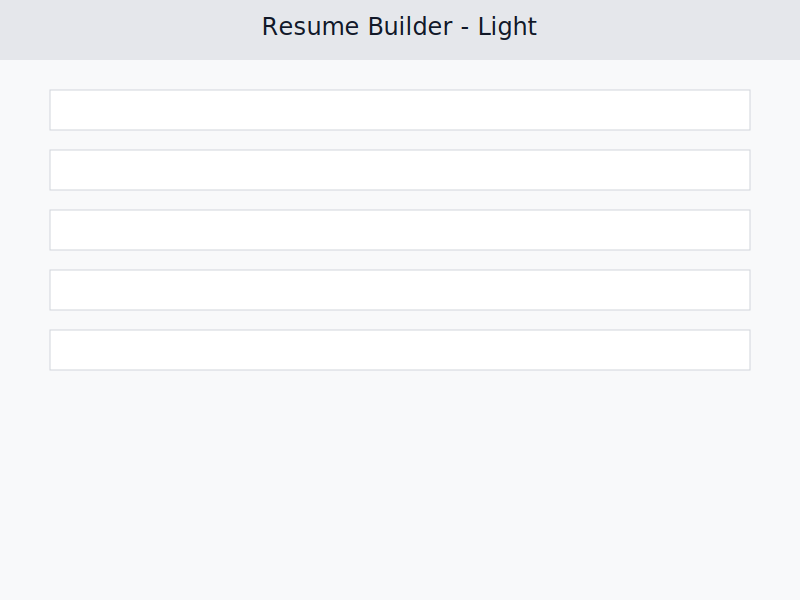
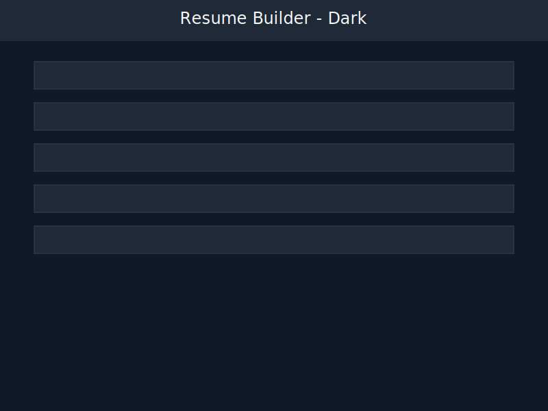

# Resume Builder

    

A responsive, theme-switchable web app built with React for crafting polished resumes. Create, edit, preview, and export resumes as A4 PDFs with AI-assisted bullet points and drag-and-drop section ordering.

## Table of Contents
- [Features](#features)
- [Demo](#demo)
- [Installation](#installation)
- [Usage](#usage)
- [Folder Structure](#folder-structure)
- [Technologies Used](#technologies-used)
- [Contributing](#contributing)
- [License](#license)
- [Contact](#contact)

## Features
- ✏️ **Flexible Sections** – Add, edit, and delete summary, skills, experience, projects, and education entries.
- 🤖 **AI Enhancements** – Improve bullet points and skills with AI and visualize changes using a before/after curtain slider.
- 🌓 **Theme Switcher** – Toggle between light and dark modes with consistent visuals.
- 👁️ **Live Preview** – Real-time resume preview with accurate A4 pagination and “Page X of Y” indicators.
- 📎 **Sticky Top Bar** – Persistent actions for loading samples, resetting data, printing, and more.
- 🖨️ **Print & PDF Export** – Export print-safe PDFs without broken headings using `react-pdf`.
- ↕️ **Drag & Drop Ordering** – Reorder sections via `react-beautiful-dnd`.
- 📱 **Responsive Layout** – Optimized for both desktop and mobile screens.

| Feature | Status |
| --- | --- |
| Section CRUD | ✅ |
| AI Bullet/Skill Suggestions | ✅ |
| Theme Switcher | ✅ |
| PDF Export | ✅ |
| Drag-and-drop Reordering | ✅ |

## Demo



Live App: [https://cv-builder-noureldeen.vercel.app/](https://cv-builder-noureldeen.vercel.app/)

## Installation
```bash
git clone https://github.com/your-username/CV-Builder.git
cd CV-Builder
npm install
```

## Usage
```bash
npm run dev
```
1. Open `http://localhost:5173` in your browser.
2. Enter resume details and reorder sections via drag-and-drop.
3. Use the AI button to enhance bullet points and skills, adjusting the curtain slider to compare changes.
4. Switch between light and dark themes using the top bar toggle.
5. Preview page counts and export the resume as an A4 PDF.

## Folder Structure
```text
CV-Builder/
├── assets/
│   ├── demo-dark.svg
│   └── demo-light.svg
├── public/
├── server/
├── src/
│   ├── assets/
│   ├── components/
│   ├── hooks/
│   ├── sections/
│   └── styles/
├── index.html
├── package.json
├── vite.config.js
└── README.md
```

## Technologies Used
| Technology | Purpose |
| --- | --- |
|  | UI components and hooks |
|  | Fast development server and bundler |
|  | Responsive styling and theming |
|  | PDF rendering and export |
|  | Drag-and-drop interactions |
|  | Bullet point and skill suggestions |

## Contributing
1. Fork the repository.
2. Create a new branch: `git checkout -b feature/your-feature`.
3. Commit your changes: `git commit -m 'Add your feature'`.
4. Push to the branch: `git push origin feature/your-feature`.
5. Open a pull request.

## License
Distributed under the MIT License. See [LICENSE](LICENSE) for more information.

## Contact
- GitHub: [NoureldeenF](https://github.com/NoureldeenF)
- LinkedIn: [Noureldeen Fahmy](https://www.linkedin.com/in/noureldeen-fahmy/)
- Email: [nourfahmy2003@gmail.com](mailto:nourfahmy2003@gmail.com)
